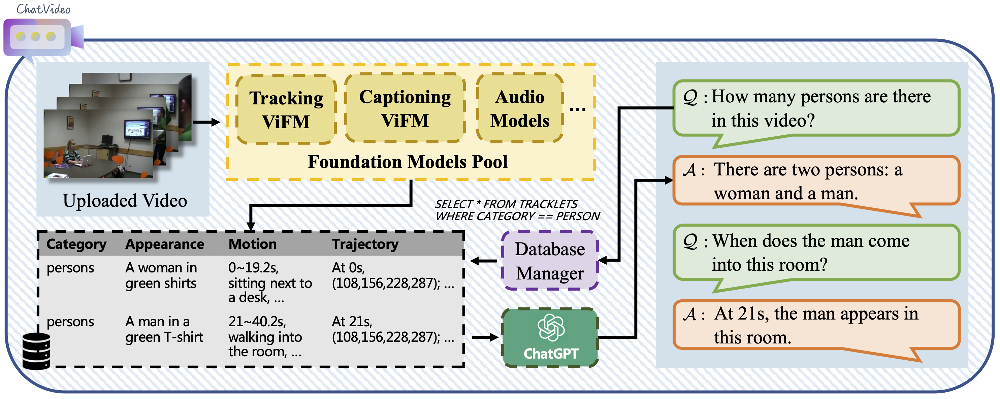
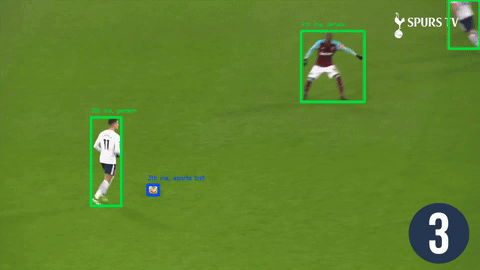
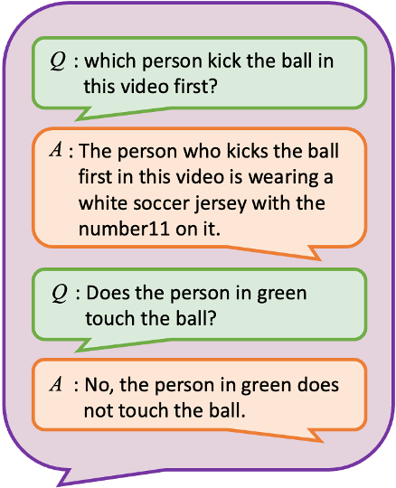
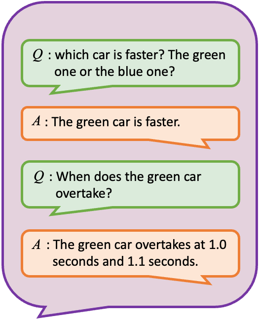
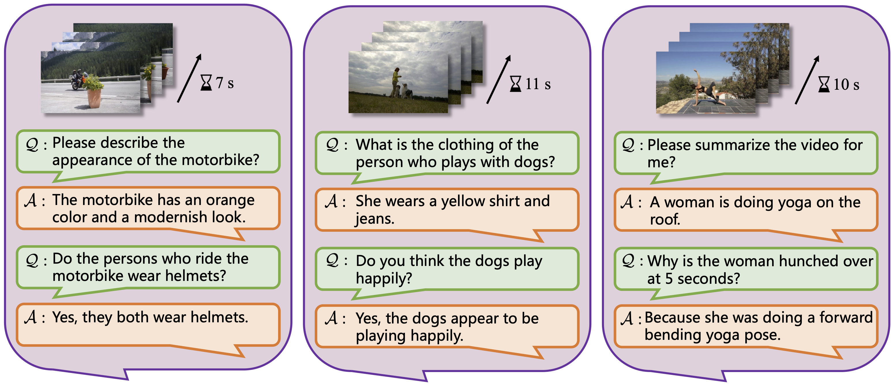
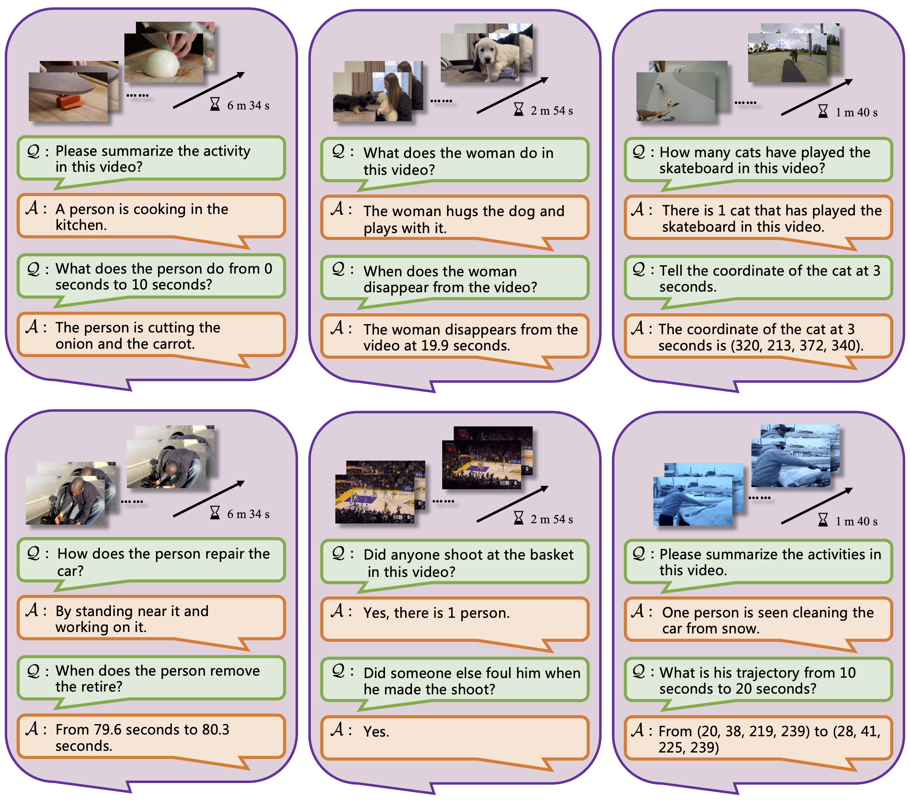
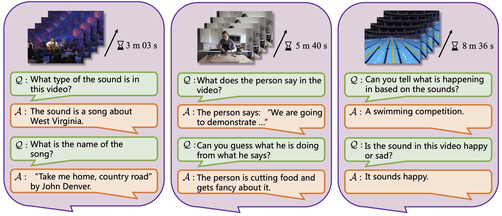

## ChatVideo: A Tracklet-centric Multimodal and Versatile Video Understanding System

Pytorch implementation of the following paper:

<div align='center'><font size='50'> <a href="https://arxiv.org/abs/2304.14407" style="text-decoration: none">ChatVideo: A Tracklet-centric Multimodal and Versatile Video Understanding System</a></font></div>

<div align='center'><a href="https://www.wangjunke.info/" style="text-decoration: none">Junke Wang<sup>1,2</sup></a>,<a href="https://www.dongdongchen.bid/" style="text-decoration: none">Dongdong Chen<sup>3</sup></a>,YiWeng Xie<sup>1,2</sup>,<a href="https://www.microsoft.com/en-us/research/people/cluo/" style="text-decoration: none">Chong Luo<sup>4</sup></a>,<a href="https://sites.google.com/site/xiyangdai/?pli=1" style="text-decoration: none">Xiyang Dai<sup>3</sup></a>, <a href="https://www.microsoft.com/en-us/research/people/luyuan/" style="text-decoration: none">Lu Yuan<sup>3</sup></a>, <a href="https://zxwu.azurewebsites.net/" style="text-decoration: none">Zuxuan Wu<sup>1,2†</sup></a>,<a href="https://fvl.fudan.edu.cn/people/yugangjiang/" style="text-decoration: none">Yu-Gang Jiang<sup>1,2†</sup></a>
</div>

<p class="banner" align="center"><sup>1</sup>Shanghai Key Lab of Intell. Info. Processing, School of CS, Fudan University. <br>
<sup>2</sup>Shanghai Collaborative Innovation Center on Intelligent Visual Computing. <br>
<sup>3</sup>Microsoft Cloud + AI, <sup>4</sup>Microsoft Research Asia. <br>
† denotes correspoinding authors.</p>

--- 

<p align="center">

</p>

## Introduction

- 🔥 We upgrade ChatVideo by integrating more powerful tracking model (SAM2), and captioning model (LLaVA-Next).
- 🚀 ChatVideo allows ChatGPT to watch videos for you, for the first time, it enables the instance-level understanding in videos by detectiong, tracking, and captioning the tracklets.

## Case Studies
<div class="picture_wrapper" align="center">
  
  
  
  
  <p style="text-align: center">ChatVideo examples </p>
</div>

<div class="picture_wrapper" align="center">
                
                <p style="text-align: center">ChatVideo for Appearance Understanding. </p>
                
                <p style="text-align: center">ChatVideo for Motion Understanding. </p>
                
                <p style="text-align: center">ChatVideo for Audio Understanding </p>
            </div>

## Installation

### 1. Clone the Repository
```
git clone https://github.com/yiwengxie/Chat-Video.git
cd Chat-Video
```

### 2. Create Conda Environment

Firstly, create the conda env:
```
conda create --name chat python=3.10
```

```
# Install pytorch:
conda install pytorch==2.3.1 torchvision==0.18.1 torchaudio==2.3.1 pytorch-cuda=12.1 -c pytorch -c nvidia

# Groundeding-DINO and SAM2
cd projects/GroundedSAM2/
pip install -e .
pip install --no-build-isolation -e grounding_dino

# LLaVA NeXT
cd projects/LLaVA_NeXT/
pip install -e ".[train]"

# Instal other dependencies:
pip install -r requirements.txt
```


### 3. Download Checkpoints
```
cd projects/GroundedSAM2/checkpoints
bash download_ckpts.sh

cd ../gdino_checkpoints
bash download_ckpts.sh
```

## License
This project is released under the MIT license. Please see the [LICENSE](LICENSE) file for more information.

## Acknowledgements

We appreciate the open source of the following projects: [SAM2](https://github.com/facebookresearch/sam2), [Grounded-SAM2](https://github.com/IDEA-Research/Grounded-SAM-2/), [LLaVA-Next](https://github.com/LLaVA-VL/LLaVA-NeXT), [Whisper](https://github.com/openai/whisper), [UNINEXT](https://github.com/MasterBin-IIAU/UNINEXT), [BLIP2](https://github.com/salesforce/LAVIS).

## Citation
If you find this repository helpful, please consider citing:
```
@article{wang2023chatvideo,
    title={ChatVideo: A Tracklet-centric Multimodal and Versatile Video Understanding System},
    author={Wang, Junke and Chen, Dongdong and Luo, Chong and Dai, Xiyang and Yuan, Lu and Wu, Zuxuan and Jiang, Yu-Gang},
    journal={arXiv preprint arXiv:2304.14407},
    year={2023}
}

@inproceedings{wang2022omnivl,
  title={Omnivl: One foundation model for image-language and video-language tasks},
  author={Wang, Junke and Chen, Dongdong and Wu, Zuxuan and Luo, Chong and Zhou, Luowei and Zhao, Yucheng and Xie, Yujia and Liu, Ce and Jiang, Yu-Gang and Yuan, Lu},
  booktitle={NeurIPS},
  year={2022}
}

@article{wang2023omnitracker,
  title={Omnitracker: Unifying object tracking by tracking-with-detection},
  author={Wang, Junke and Chen, Dongdong and Wu, Zuxuan and Luo, Chong and Dai, Xiyang and Yuan, Lu and Jiang, Yu-Gang},
  journal={arXiv preprint arXiv:2303.12079},
  year={2023}
}

@inproceedings{wang2024omnivid,
  title={Omnivid: A generative framework for universal video understanding},
  author={Wang, Junke and Chen, Dongdong and Luo, Chong and He, Bo and Yuan, Lu and Wu, Zuxuan and Jiang, Yu-Gang},
  booktitle={CVPR},
  year={2024}
}

```
